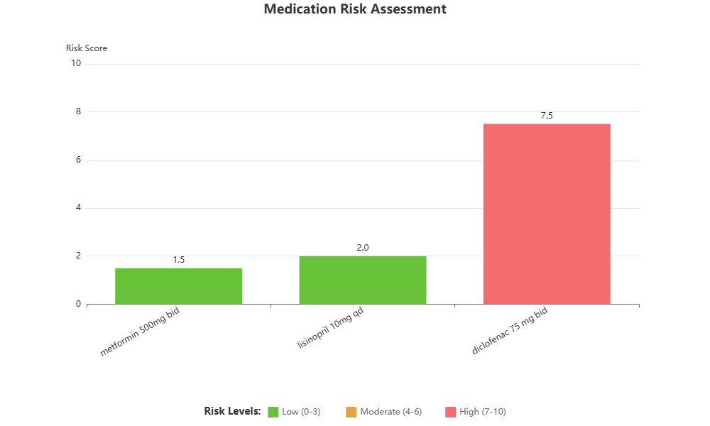

**Clinician-Facing Summary Report**

**Summary**
This 55-year-old adult with hypertension and type 2 diabetes is currently prescribed metformin 500 mg BID, lisinopril 10 mg daily, and diclofenac 75 mg BID. The combination of lisinopril (ACE inhibitor) and diclofenac (NSAID) poses a significant risk of reduced antihypertensive efficacy and acute kidney injury (AKI). Renal function is unknown, which is a critical gap. Metformin is generally safe but requires renal monitoring, especially when combined with nephrotoxic agents. No allergies, pregnancy status, or hepatic function data are available.

**Key Risks**
1. **Acute Kidney Injury (AKI):** Concomitant lisinopril and diclofenac increases AKI risk via pharmacodynamic interaction (reduced renal perfusion). This is a well-documented, clinically significant concern.
2. **Reduced Antihypertensive Efficacy:** Diclofenac may blunt the blood pressure-lowering effect of lisinopril, potentially worsening hypertension control.
3. **Metformin Contraindication:** Metformin is contraindicated if eGFR <30 mL/min. Without renal function data, this cannot be assessed.
4. **Uncertainties:** No human data support a clinically relevant metformin-diclofenac synergy for pain or cancer. Animal studies are not translatable to human dosing or safety.

**Recommended Next Steps (Tests/Questions)**
- **Obtain baseline renal function:** Serum creatinine and eGFR immediately. This is essential before continuing the current regimen.
- **Assess blood pressure and heart rate:** Current BP and HR to evaluate for hypotension or hypertension.
- **Ask about symptoms:** Inquire about decreased urine output, leg swelling, dizziness, or fainting—signs of AKI or hypotension.
- **Clarify medication list:** Confirm whether tizanidine is also prescribed (mentioned in evidence but not in intake). If present, risk of severe hypotension/bradycardia increases.
- **Obtain hepatic panel:** Diclofenac and metformin require hepatic monitoring; baseline LFTs are prudent.
- **Assess pain indication:** Determine why diclofenac is prescribed and whether an alternative (e.g., acetaminophen) is appropriate.

**Monitoring Plan**
- **Renal function:** Recheck serum creatinine and eGFR within 48–72 hours of starting or continuing diclofenac with lisinopril.
- **Blood pressure:** Monitor at each visit and consider home BP monitoring.
- **Urine output:** Educate patient to report any decrease in urination or new swelling.
- **Avoid NSAIDs if possible:** Strongly consider discontinuing diclofenac. If absolutely necessary, use lowest effective dose for shortest duration, only after confirming eGFR >60 mL/min and stable BP.
- **Counseling:** Advise patient to seek urgent care for oliguria, edema, severe dizziness, or syncope.

**Disclaimer**
This report is for informational purposes only and does not constitute medical advice. Clinical decisions should be based on a complete patient evaluation, including renal function, blood pressure, and individual risk factors. The clinician should verify all medications, allergies, and laboratory values before making treatment changes.

## Risk Assessment Chart

